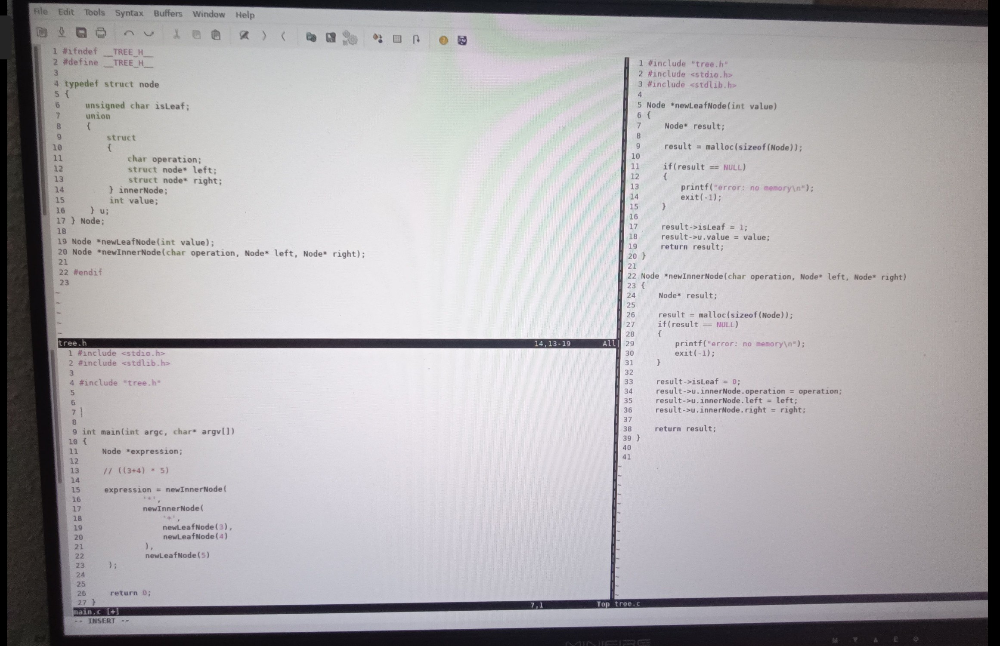
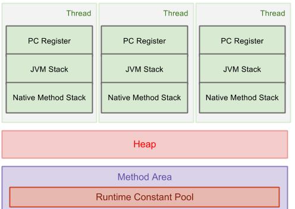

# Ninja Virtual Machine (NJVM)

Dies ist meine Implementierung der **Ninja Virtual Machine** im Rahmen der KSP-Übung.  
Das Projekt umfasst die dynamische Verwaltung von **Stack** und **Heap** sowie die Anbindung der externen **BigInt-Bibliothek**.

---
## Aufgabenstellung / Hintergrund

Eine **virtuelle Maschine (VM)** ist ein Software-System, das Programme ausführt, die nicht direkt in Maschinencode geschrieben sind, sondern in einer **Zwischensprache** (hier: Ninja Bytecode).  
Dadurch wird eine klare Trennung zwischen **Programm** und **Hardware** erreicht:

- Programme laufen plattformunabhängig, solange eine VM existiert
- Die VM übernimmt Verwaltung von Speicher (Stack, Heap), Arithmetik und Kontrollfluss
- Erweiterungen (wie Garbage Collection oder BigInt-Support) können in der VM implementiert werden, ohne den Bytecode zu ändern

### Konkret in dieser Übung:
- Implementiere eine VM, die Ninja-Bytecode-Dateien (`.bin`) interpretieren kann.
- Beim Start:
  - **Stack** wird dynamisch mit `malloc()` angelegt  
    - Größe wählbar mit `--stack n` (in KiB, Default = 64)
  - **Heap** wird dynamisch mit `malloc()` angelegt  
    - Größe wählbar mit `--heap n` (in KiB, Default = 8192)
  - Der Heap wird in **zwei Hälften** geteilt, um später Garbage Collection zu ermöglichen.
- Die VM führt das Programm aus, das in der `.bin`-Datei gespeichert ist, und verwaltet Objekte (primitive und zusammengesetzte).
- Bei zu kleinem Heap:
### Architekturübersicht

- **Stack**: Dynamisch mit `malloc()` angelegt, speichert lokale Variablen und Rücksprungadressen.
- **Heap**: Dynamisch mit `malloc()` angelegt, speichert Objekte und Arrays. Bei Überlauf wird ein Fehler ausgegeben.
- **Register**: Enthält den Program Counter (PC), der die Adresse der nächsten auszuführenden Anweisung speichert.
- **Program Counter (PC)**: Zeigt auf die aktuelle Ausführungsposition im Bytecode.
- 
## Features
- Heap und Stack werden beim Programmstart dynamisch mit `malloc()` angelegt
- Größe von Heap und Stack kann über Kommandozeilenparameter angegeben werden:
  - `--heap n` → Heapgröße `n * 1024` Bytes (Standard: 8192 KiB)
  - `--stack n` → Stackgröße `n * 1024` Bytes (Standard: 64 KiB)
- Heap wird in zwei gleich große Hälften geteilt  
- Speicherallokation erfolgt fortlaufend aus einer Heap-Hälfte  
- Bei Überlauf → Ausgabe: `Error: heap overflow`  
- Unterstützung für primitive und zusammengesetzte Objekte  
- Nutzung der BigInt-Bibliothek für arithmetische Operationen

---
arc

